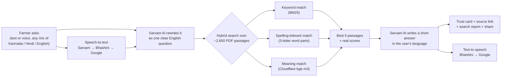
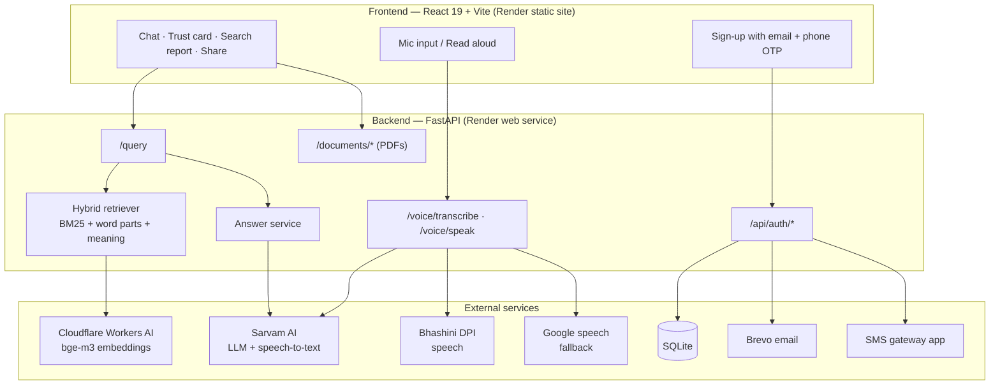

# Sahakar Sahayak (सहकार सहायक) 🇮🇳
### A multilingual, voice-enabled assistant for Indian cooperative societies and farmers

[](https://fastapi.tiangolo.com)
[](https://react.dev)
[](https://www.sarvam.ai)
[](https://bhashini.gov.in)
[](https://python.org)

**Sahakar Sahayak** answers questions about **cooperative societies** (registration, bye-laws, audits, elections, PACS schemes) and **farmer welfare schemes** (PM-KISAN, PMFBY crop insurance, Kisan Credit Card, PMKSY irrigation) in **English, Hindi, Kannada and Nepali** — typed or spoken, even in mixed language like *"PM Kisan yojane alli varshakke eshtu duddu sigutte?"*.

Every answer tells the user **where it came from**: an official government PDF (with a clickable link to the exact page) or general guidance that should be confirmed with the cooperative office.

- 🌐 **Live app:** https://sahakar-sahayak-frontend.onrender.com
- 📊 **Live accuracy scoreboard:** https://sahakar-sahayak-4.onrender.com/scoreboard
- ⚙️ **API docs (Swagger):** https://sahakar-sahayak-4.onrender.com/docs

> Hosted on free servers — if the app has been idle, the first answer can take up to a minute while the server wakes up.

---

## ✨ What it does

| Feature | How it works |
|---|---|
| 🗣️ **Ask in your language** | Type or speak in English, Hindi, Kannada or Nepali — including mixed language, local dialect and spelling mistakes. Sarvam AI rewrites the question into clear English for searching, and answers back in the user's chosen language. |
| 🔎 **Hybrid document search** | 11 official PDFs are split into ~2,650 passages. Each question is matched three ways: **keyword (BM25)**, **spelling-tolerant (3-letter word parts, so *kisan ≈ kishan*)** and **meaning (Cloudflare Workers AI, `bge-m3` embeddings)**. When a question names a scheme or law (PM-KISAN, KCC, PMKSY, Karnataka Act…), that scheme's own PDF is preferred (**scheme routing**). |
| ✅ **Trust card on every answer** | 🟢 *Verified from official document* · 🟡 *Partly verified* · 🔵 *General guidance* — plus the exact PDF and page, one tap to open it. |
| 📊 **Search report** | Tap to see the real numbers behind an answer: keyword %, spelling %, meaning %, final confidence, passages searched, candidates compared, search time and total response time. |
| 🚫 **Stays on topic** | Questions about cricket, movies, politics etc. are politely refused. |
| 🔊 **Voice in, voice out** | Speech-to-text with a 3-level fallback (**Sarvam → Bhashini → Google**) and text-to-speech (**Bhashini → Google**). |
| 📤 **Share the full answer** | One tap shares the question, full answer and source link to WhatsApp (or any app on a phone). |
| 🔐 **Secure sign-up** | Email **and** phone OTP verification, hashed OTPs, attempt limits, resend cooldown; the account is only created after both are verified. |
| 🤖 **Telegram bot** | The same assistant on Telegram, with a language menu (Kannada / English / Hindi). |

---

## 🧠 How an answer is produced



**Scoring (per passage)**

| Signal | Meaning | Weight in final score |
|---|---|---|
| Keyword match | share of the question's important words found exactly | 35% |
| Spelling-tolerant match | share of the question's 3-letter word parts found | 15% |
| Meaning match | Cloudflare `bge-m3` similarity, scaled 0–100% | 50% |

A passage is only used if its keyword **or** meaning match is strong enough. If nothing qualifies, the answer is labelled *General guidance* and no source is shown — the app never pretends an answer came from a document when it didn't.

**Resilience:** if Cloudflare is unavailable, search continues with keyword + spelling only. If Sarvam's safety filter rejects a request, it retries once without the document text, and the user only ever sees a friendly message — never an error dump.

---

## 📊 Accuracy scoreboard

`evaluate_rag.py` runs **26 test questions** (13 farmer-scheme, 8 cooperative-law, 2 mixed Kannada/Hindi + English, 3 off-topic) through the full pipeline — search **and** Sarvam's written answers. Every expected answer (document, page and key fact such as “72 hours” or “₹6,000”) was checked by hand against the official PDFs.

Full test, 2026-09-27 (meaning search on):

| Metric | Result |
|---|---|
| Answer contains the correct fact | **95.65%** |
| Correct official document among the passages given to the AI | **100.00%** |
| Correct official document ranked #1 | **100.00%** |
| Cooperative-law questions answered correctly | **100.00%** |
| Mixed-language questions understood and answered | **100.00%** |
| Off-topic questions refused | **100.00%** |
| Average response time | **1.82 s** |
| **Overall (fact + correct source shown, or correct refusal)** | **25 / 26 (96.15%)** |

The latest numbers are always in [`benchmark_report.md`](benchmark_report.md), which is regenerated on every run.

**See it live, no setup:** open **https://sahakar-sahayak-4.onrender.com/scoreboard** — it shows the full result with every question and the AI's actual answer. Visitors can press *Re-check search now* (~2 s, free — no AI credits used) to re-run the search part live.

Or run it in a terminal:

```bash
python3 evaluate_rag.py          # search only, no API keys needed (~1 s)
python3 evaluate_rag.py --full   # + Sarvam answers (reads keys from a local .env file, never committed)
```

Results are saved to `benchmark_results.json` and `benchmark_report.md`.

---

## 📚 Knowledge base (official documents)

Stored in `backend/data/documents/` and served at `/documents/<file>` so every source link opens the real PDF on the right page.

| Document | Topic |
|---|---|
| Karnataka Co-operative Societies Act, 1959 | State cooperative law |
| Multi-State Co-operative Societies (Amendment) Act, 2023 | Central cooperative law |
| Model Bye-laws for PACS (Ministry of Cooperation, 2023) | PACS membership, governance, audit |
| Ministry of Cooperation — Initiatives Booklet (2025) | PACS computerisation, Jan Aushadhi, CSCs, storage |
| RBI — Kisan Credit Card Directions for Rural Co-operative Banks (2026) | KCC limits, tenure, collateral |
| PMFBY Operational Guidelines 2023 | Crop insurance, claims, loss reporting |
| RWBCIS Revised Guidelines | Weather-based crop insurance |
| Unified Package Insurance Scheme (UPIS) | Farmer package insurance |
| PM-KISAN Revised Operational Guidelines | ₹6,000/year income support |
| PMKSY Operational Guidelines | Irrigation / Per Drop More Crop |
| New Schemes (summary) | Plain-language scheme summaries |

---

## 🏛️ Architecture



---

## 📡 API reference

| Method | Endpoint | Description |
|---|---|---|
| `POST` | `/query` | Ask a question. Body: `{"query": "...", "language": "en\|hi\|kn\|ne"}` |
| `POST` | `/voice/transcribe` | Audio file → text (Sarvam → Bhashini → Google) |
| `POST` | `/voice/speak` | Text → audio (Bhashini → Google) |
| `GET` | `/documents/{file}` | Opens an official PDF (add `#page=N`) |
| `GET` | `/health` | Health check (used by the uptime pinger) |
| `GET` | `/scoreboard` | Live accuracy scoreboard page (run tests from the browser) |
| `GET` | `/scoreboard.json` | Last scoreboard result as JSON |
| `POST` | `/api/auth/register/initiate` | Start sign-up, sends email + phone OTP |
| `POST` | `/api/auth/register/verify-email` · `/verify-phone` | Verify each OTP |
| `POST` | `/api/auth/register/resend-otp` | Resend OTP (60 s cooldown) |
| `GET` | `/api/auth/register/status/{id}` | Verification progress |
| `POST` | `/api/auth/login` | Log in with email **or** phone + password |
| `GET` / `PUT` | `/api/auth/me` · `/api/auth/profile` | Profile (Bearer token) |
| `POST` | `/api/auth/password-reset/send-otp` · `/confirm` | Password reset |

**`/query` response (main fields)**

```json
{
  "answer": "Crop loss due to localized calamities must be reported within 72 hours ...",
  "language": "en",
  "trust_level": "verified",
  "confidence": 0.8406,
  "sources": [{ "document": "doc1.pdf", "page": 103, "link": "https://.../documents/doc1.pdf#page=103", "score": 84.06 }],
  "search_report": {
    "final_confidence": 84.06, "keyword_score": 66.67, "spelling_score": 82.5, "meaning_score": 61.23,
    "pieces_searched": 2655, "pdfs_searched": 11, "candidates_compared": 36,
    "search_time_ms": 13.81, "total_time_ms": 3421.5, "top_sources": ["..."]
  }
}
```

---

## ⚙️ Environment variables

Set these in Render → Environment (never commit real values). See `.env.example`.

| Variable | Used for |
|---|---|
| `SARVAM_API_KEY` | Sarvam AI (question rewriting, answers, speech-to-text) |
| `CLOUDFLARE_ACCOUNT_ID`, `CLOUDFLARE_API_TOKEN` | Meaning search (optional — word search works without it) |
| `BHASHINI_USER_ID`, `BHASHINI_API_KEY` | Bhashini speech |
| `JWT_SECRET` | Login tokens |
| `EMAIL_API_KEY`, `SENDER_EMAIL` | Email OTP (Brevo) |
| `GATEWAY_API_KEY` | Phone OTP (SMS gateway app) |
| `DATABASE_URL` | Database (defaults to SQLite) |
| `PUBLIC_BACKEND_URL` | Public backend address used in PDF links |
| `TELEGRAM_BOT_TOKEN`, `API_URL` | Telegram bot |
| `VITE_API_URL` (frontend) | Backend address for the React app |

When email/SMS keys are missing (local development), OTPs are printed to the backend console instead.

---

## 🚀 Run locally

```bash
# Backend
pip install -r requirements.txt
python -m uvicorn backend.main:app --host 127.0.0.1 --port 8000 --reload
#   → http://127.0.0.1:8000/docs

# Frontend (second terminal)
npm install
npm run dev
#   → http://localhost:5173

# Telegram bot (optional, third terminal)
python backend/telegram_bot.py
```

The search index (`backend/data/chunks_cache.json`) is rebuilt automatically whenever PDFs are added or removed.

---

## 🧪 Tests

```bash
python3 backend/test_auth.py     # 16 sign-up / OTP / login security tests
python3 test_search.py           # quick look at search scores for sample questions
python3 evaluate_rag.py          # accuracy scoreboard (see above)
npm run build                    # frontend build check
```

---

## 📁 Project structure

```
backend/
  main.py                  FastAPI app, voice endpoints, PDF serving
  routes/query.py          /query pipeline
  routes/auth.py           sign-up, OTP, login
  routes/scoreboard.py     live /scoreboard page
  services/rag_service.py  question rewriting, answer, trust level, search report
  services/retriever.py    hybrid search (BM25 + word parts + Cloudflare meaning)
  services/nlp_service.py  cleaning, language check, intent
  services/auth_service.py passwords, OTPs, JWT, email/SMS dispatch
  data/documents/          official PDFs
  telegram_bot.py          Telegram bot
anadi_voice_engine.py      speech-to-text / text-to-speech with fallbacks
src/
  pages/Chat.jsx           chat screen
  components/chat/AnswerFooter.jsx  trust card, share, search report
evaluate_rag.py            accuracy scoreboard
test_search.py             search smoke test
```

---

## 🛣️ Limitations & next steps

- Knowledge base covers Karnataka + central cooperative law; other states' Acts can be added by dropping PDFs into `backend/data/documents/`.
- Scanned (image-only) PDFs can't be read yet — OCR is a planned addition.
- Planned: state selection for state-specific rules, an admin dashboard of common questions by district, and a "talk to a cooperative officer" hand-off for disputes and complaints.

---

## 🙏 Acknowledgements

Built for the **Smart India Hackathon (SIH)**. Uses India's **Bhashini** language platform and **Sarvam AI**. Official documents from the Ministry of Cooperation, Ministry of Agriculture & Farmers Welfare, the Reserve Bank of India, and the Government of Karnataka.
